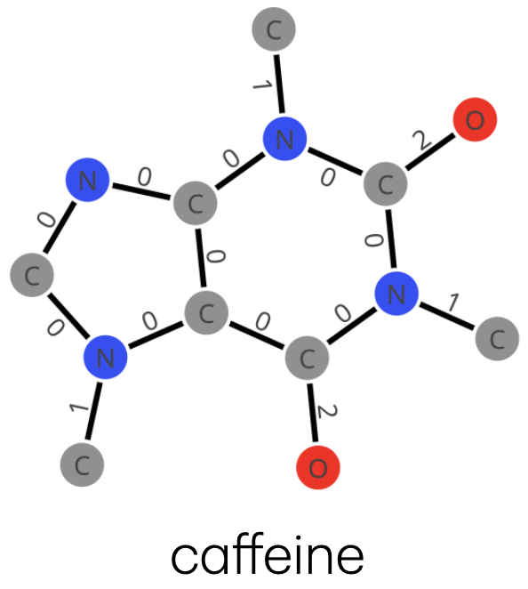
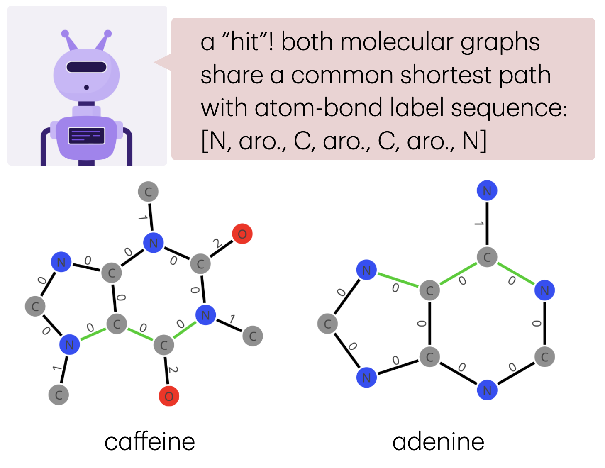

# `ShortestPathMolecularGraphKernels.jl`

## overview
a *molecular graph* represents a molecule as a simple graph (nodes: atoms; edges: bonds) where 
(a) nodes are "labeled" with the atomic species (H, C, N, etc.) of the atoms they represent and 
(b) edges are "labeled" with the type (aromatic, single, double, triple) of bond they represent.

```@raw html

``` ⠀

a *molecular graph kernel*, loosely, scores the similarity of two molecular graphs. 
more formally, it corresponds with an inner product of two feature vectors of the molecular graphs.
so, some mapping from a molecular graph to a vector representation, theoretically, underlies a molecular graph kernel.

generally, a *shortest path molecular graph kernel* characterizes each molecular graph by 
all shortest paths between every pair of nodes in the graph.
it looks at the length of and the atom-bond label sequence along these shortest paths.
we implement two variants of the shortest path graph kernel. 
given two input molecular graphs, the kernel counts pairs of corresponding shortest paths between them having the same:
1. length and unordered pair of atom labels on the source and destination node
2. length and exact atom-bond label sequence.
the exact sequence matching is much more expressive of molecular similarity,
 but it corresponds with a sparser underlying feature vector.

```@raw html

``` ⠀

this Julia package, `ShortestPathMolecularGraphKernels.jl`:
* employs `MolecularGraph.jl` to interpret a SMILES specification of a molecular structure as a molecular graph.
* pre-computes and stores all shortest paths along the molecular graph and the atom-bond label sequences along them.
* computes the shortest path graph kernel between any two input molecular graphs, using either scoring criteria:
same (a) length and terminal node labels or (b) length and exact atom-bond label sequence.
* implements a multi-threaded computation of a Gram (molecule-molecule similarity) matrix for machine learning.


## example

first, we show how to construct a molecular graph representing caffeine from its SMILES representation.
```julia
mg = MolGraph(
    "CN1C=NC2=C1C(=O)N(C)C(=O)N2C", # SMILES
    incl_hydrogen=false             # include H atoms?
)
```

next, we search for and store all shortest paths in this molecular graph and the atom-bond label sequences along them.
```julia
find_shortest_paths!(
    mg,                 # the molecular graph
    ℓ_max=typemax(Int)  # the max path length
)
```

we can visualize the molecular graph and explore any path on it:
```julia
id_spath = 39                # index of shortest path to look at
mg.spaths[id_spath]          # shows all info abt this shortest path
viz(mg, id_spath=id_spath)   # visualize graph and highlight shortest path
```

```@raw html

``` ⠀

finally, we can compute the shortest path graph kernel between a pair of molecular graphs using either scoring criteria:
```julia
caf = MolGraph("CN1C=NC2=C1C(=O)N(C)C(=O)N2C")   # caffeine
ibu = MolGraph("CC(C)CC1=CC=C(C=C1)C(C)C(=O)O")  # ibuprofin
find_shortest_paths!.([caf, ibu])                 

# criterion: score using atom label set on src and dst nodes paired with length
shortest_path_graph_kernel(ba, ibu, exact_seq_matching=false) # 458.0
# criterion: score using exact atom-bond label sequence (implicitly, length, too)
shortest_path_graph_kernel(ba, ibu, exact_seq_matching=true)  # 206.0
```

for computing a Gram matrix, we have a multi-threaded implementation:
```julia
Threads.nthreads() # to see the number of threads I have available
# list of molecular graphs
mgs = MolGraph.(
    [
        "CN1C=NC2=C1C(=O)N(C)C(=O)N2C", 
        "O=C(O)c1ccccc1",
        "CC(C)CC1=CC=C(C=C1)C(C)C(=O)O",
        "CN1C=NC2=C1C(=O)N(C)C(=O)N2C"
    ]
)

# pre-compute shortest paths
find_shortest_paths!.(mgs)

# compute Gram matrix
K = compute_Gram_matrix(mgs, false) # K[i, j] = K[j, i]: similarity btwn molecular graphs i & j
```

## references
Kriege NM, Johansson FD, Morris C. A survey on graph kernels. Applied Network Science. 2020.

Borgwardt KM, Kriegel HP. Shortest-path kernels on graphs. In Fifth IEEE international conference on data mining. 2005.

Rupp M, Schneider G. Graph kernels for molecular similarity. Molecular Informatics. 2010.

## docs

```@docs
MolGraph
AtomType
BondType
ShortestPath
find_shortest_paths!
get_shortest_paths
shortest_path_graph_kernel
compute_Gram_matrix
viz
```
