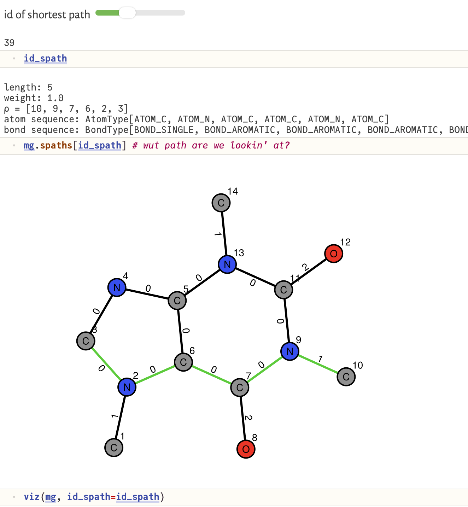

# `ShortestPathMolecularGraphKernels.jl`

## overview
a *molecular graph* represents a molecule as a simple graph (nodes: atoms; edges: bonds) where (a) nodes are "labeled" with the atomic species (H, C, N, etc.) and (b) edges are "labeled" with the bond type (aromatic, single, double, triple).

a *molecular graph kernel*, loosely, scores the similarity of two molecular graphs. formally, it corresponds with an inner product of two feature vectors of the molecular graphs. 

generally, a *shortest path molecular graph kernel* characterizes each molecular graph by its shortest paths between every pair of nodes and the atom-bond label sequences along those paths. we implement two variants that, given two input molecular graphs, count pairs of corresponding shortest paths with the same:
1. length and unordered pair of atom labels on the source and destination node
2. length and exact atom-bond label sequence.
the exact sequence matching is much more expressive of molecular similarity but corresponds with a sparser feature vector.

this Julia package, `ShortestPathMolecularGraphKernels.jl`:
* employs `MolecularGraph.jl` to interpret a SMILES specification of a molecular structure as a molecular graph.
* pre-computes and stores all shortest paths along the molecular graph and the atom-bond label sequences along them.
* computes the shortest path graph kernel between any two input molecular graphs, using either (a) length and terminal node labels or (b) length and exact atom-bond label sequence scoring criteria.
* implements a multi-threaded Gram matrix computation.


## example

first, we show how to construct a molecular graph representing caffeine from its SMILES representation.
```julia
mg = MolGraph(
    "CN1C=NC2=C1C(=O)N(C)C(=O)N2C", # SMILES
    incl_hydrogen=false             # "include H atoms?
)
```

next, we search for and store all shortest paths and the atom-bond label sequences along them.
```julia
find_shortest_paths!(
    mg,                 # the molecular graph
    ℓ_max=typemax(Int)  # the max path length
)
```

we can visualize the molecular graph and explore any path on it.
```julia
id_spath = 39                # index of shortest path to look at
mg.spaths[id_spath]          # shows all info abt this shortest path
viz(mg, id_spath=id_spath)   # visualize
```



finally, what this is all about: computing the shortest path graph kernel between a pair of molecular graphs.
```julia
caf = MolGraph("CN1C=NC2=C1C(=O)N(C)C(=O)N2C")   # caffeine
ibu = MolGraph("CC(C)CC1=CC=C(C=C1)C(C)C(=O)O")  # ibuprofin
find_shortest_paths!.([caf, ibu])                 

shortest_path_graph_kernel(ba, ibu, exact_seq_matching=false) # 458.0
shortest_path_graph_kernel(ba, ibu, exact_seq_matching=true) # 206.0
```

see [`compute_Gram_matrix`](@ref) for a multi-threaded implementation of computing a matrix of kernel values between a list of molecular graphs.

## references
Kriege NM, Johansson FD, Morris C. A survey on graph kernels. Applied Network Science. 2020.

Borgwardt KM, Kriegel HP. Shortest-path kernels on graphs. In Fifth IEEE international conference on data mining. 2005.

Rupp M, Schneider G. Graph kernels for molecular similarity. Molecular Informatics. 2010.

## docs

```@docs
MolGraph
AtomType
BondType
ShortestPath
find_shortest_paths!
get_shortest_paths
shortest_path_graph_kernel
compute_Gram_matrix
viz
```
